# Real-Time Confidence System Documentation

## Overview

The Real-Time Confidence System is a critical component of the Scalping Bot that acts as a **gatekeeper** for all trade executions. It analyzes 8 weighted technical indicators in real-time to determine whether a trading signal should be executed or blocked.

## System Architecture

### Core Components

1. **`core/real_time_confidence.py`** - Main confidence calculation engine
2. **`stock_specific_config.py`** - Trade execution decision logic
3. **`scripts/confidence_integrator.py`** - GUI integration and real-time feeds
4. **`scripts/scalping_command_center.py`** - Visual confidence monitoring

## How It Works

### 1. Signal Generation Flow

```mermaid
graph TD
    A[Strategy Generates Signal] --> B[should_execute_trade Called]
    B --> C[Real-Time Confidence Calculated]
    C --> D{Confidence >= 75%?}
    D -->|Yes| E[✅ EXECUTE TRADE]
    D -->|No| F[❌ BLOCK TRADE]
```



### 2. Technical Indicator Analysis

The system evaluates 8 technical indicators with specific weights:

| Indicator | Weight | Purpose |
|-----------|--------|---------|
| **MACD Alignment** | 15% | Trend momentum confirmation |
| **EMA Trend** | 15% | Short-term trend direction |
| **RSI Position** | 10% | Overbought/oversold conditions |
| **Volume Confirmation** | 15% | Trade volume validation |
| **VWAP Position** | 10% | Price vs. volume-weighted average |
| **Bollinger Position** | 10% | Volatility and price extremes |
| **Momentum Strength** | 15% | Price momentum analysis |
| **Volatility Match** | 10% | Market volatility assessment |

### 3. Confidence Calculation Logic

#### Base Configuration
- **Starting Confidence**: 85%
- **Minimum Threshold**: 75%
- **Maximum Possible**: 100%

#### Scoring System
Each indicator contributes points based on favorable conditions:

```python
# Example scoring logic
def score_macd_alignment(self, indicators):
    """MACD trend alignment scoring (15% weight)"""
    macd_line = indicators['macd_line'].iloc[-1]
    macd_signal = indicators['macd_signal'].iloc[-1]
    
    if macd_line > macd_signal:  # Bullish
        return 15.0
    elif macd_line < macd_signal:  # Bearish
        return -15.0
    else:
        return 0.0
```

## Integration with Trading Strategies

### Strategy Signal Generation
Your three main strategies generate signals independently:

1. **Mean Reversion Strategy** (`strategies/mean_reversion.py`)
   - Identifies oversold/overbought conditions
   - Generates reversal signals

2. **Momentum Scalp Strategy** (`strategies/momentum_scalp.py`)
   - Captures short-term price momentum
   - Generates trend-following signals

3. **VWAP Bounce Strategy** (`strategies/vwap_bounce.py`)
   - Trades price reactions at VWAP levels
   - Generates mean-reversion signals

### Confidence Validation Process

```python
# From main.py execution flow
def execute_signal(self, signal):
    symbol = signal['symbol']
    action = signal['action']
    
    # CRITICAL: Confidence check before execution
    trade_decision = should_execute_trade(symbol)
    
    if not trade_decision['execute']:
        self.logger.info(f"[CONFIDENCE BLOCK] {symbol} - {trade_decision['reason']}")
        return False
    
    self.logger.info(f"[CONFIDENCE OK] {symbol} - {trade_decision['reason']}")
    # Proceed with actual trade execution...
```

## Real-World Example

### Scenario: INTC Buy Signal

**Strategy Decision**: Mean Reversion detects INTC is oversold → Generate BUY signal

**Confidence Analysis**:
```
🎯 FINAL TRADE DECISION CHECK: INTC (LONG)

Technical Indicator Scores:
✅ MACD Alignment: +15.0 (bullish crossover)
❌ EMA Trend: -15.0 (below EMA9)
✅ RSI Position: +10.0 (oversold recovering)
✅ Volume Confirmation: +15.0 (above average)
❌ VWAP Position: -10.0 (below VWAP)
✅ Bollinger Position: +10.0 (near lower band)
✅ Momentum Strength: +15.0 (improving)
✅ Volatility Match: +10.0 (normal volatility)

Base Confidence: 85%
Adjustments: +40.0 points
Final Confidence: 75.0%
Threshold: 75.0%
```

**Decision**: ✅ **EXECUTE** (exactly meets threshold)

**Log Output**: `[EXECUTED] Buy order for INTC - Trade #15 | Confidence: 75.0%`

## Configuration and Thresholds

### Global Settings (`config.py`)
```python
MIN_CONFIDENCE_THRESHOLD = 0.75  # 75% minimum for execution
BASE_CONFIDENCE = 0.85          # 85% starting point
```

### Stock-Specific Adjustments
Each stock can have custom confidence requirements based on:
- Historical volatility
- Liquidity characteristics
- Trading volume patterns

## Error Handling and Safety

### Fail-Safe Mechanisms

1. **No Fallback Trading**: If confidence calculation fails → NO TRADE
2. **Real-Time Validation**: Fresh calculation for every trade decision
3. **Error Logging**: Comprehensive logging of calculation failures
4. **Visual Monitoring**: Live confidence display in Command Center

### Error Response Example
```python
if confidence_data.get('mode') == 'error':
    return {
        'execute': False,
        'confidence': 0,
        'reason': f"Real-time calculation failed: {error_message}",
        'error': True
    }
```

## Visual Monitoring

### Command Center Integration

The Scalping Command Center displays real-time confidence scores:

```
🎯 CONFIDENCE MONITOR
┌─────────────────────────────────────┐
│ SOXL  $24.50  📈 82.5% ✅ TRADEABLE │
│ SOFI  $7.23   📉 68.2% ❌ BELOW THR │
│ TQQQ  $45.12  📈 91.0% ✅ TRADEABLE │
│ INTC  $32.45  📊 75.0% ✅ TRADEABLE │
│ NIO   $8.90   📉 45.5% ❌ BELOW THR │
└─────────────────────────────────────┘
```

## Benefits and Risk Management

### Key Advantages

1. **Quality Over Quantity**: Only executes high-probability trades
2. **Multi-Factor Validation**: Combines 8 different technical perspectives
3. **Adaptive Risk Management**: Adjusts to changing market conditions
4. **Transparency**: Full visibility into decision-making process
5. **Automated Risk Control**: Prevents emotional or impulsive trading

### Risk Mitigation

- **Overconfidence Protection**: Caps maximum confidence at 100%
- **Market Condition Awareness**: Adjusts for volatility and volume
- **Technical Divergence Detection**: Identifies conflicting indicators
- **Real-Time Adaptation**: Updates with every new price tick

## Technical Implementation Details

### Data Sources
- **Price Data**: Yahoo Finance via `yfinance`
- **Real-Time Updates**: Continuous data feeds
- **Indicator Calculations**: pandas/numpy for technical analysis

### Performance Optimization
- **Efficient Calculations**: Vectorized operations
- **Memory Management**: Limited historical data retention
- **Caching Strategy**: Indicator results cached temporarily

### Integration Points
```python
# Main integration points in codebase:
1. main.py: Primary execution gatekeeper
2. core/intraday_engine.py: Strategy signal validation
3. scripts/scalping_command_center.py: Visual monitoring
4. Various test files: Confidence validation testing
```

## Conclusion

The Real-Time Confidence System serves as the **"second opinion"** that must approve every trade generated by your strategies. It ensures that you only trade when multiple technical indicators align favorably, significantly improving the quality and profitability of your scalping operations.

By requiring a minimum 75% confidence score across 8 weighted technical indicators, the system acts as a sophisticated risk management layer that prevents low-probability trades while allowing high-confidence opportunities to execute automatically.

---

*Last Updated: August 18, 2025*
*System Version: Scalping Bot v2.0*
